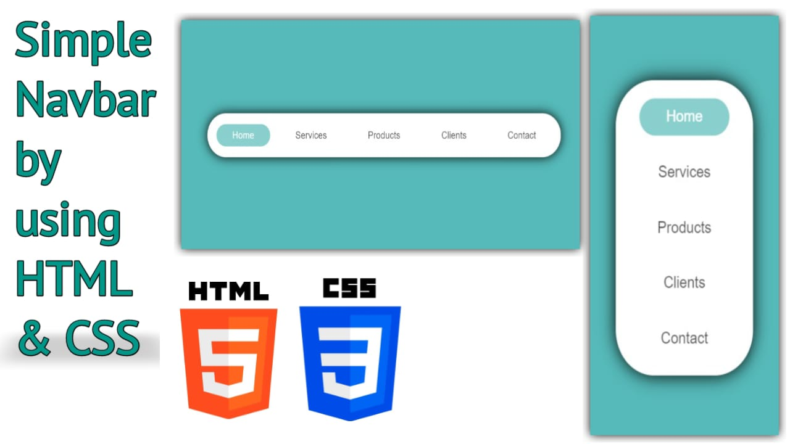

# A Simple Navbar 

## Demo Screenshot

## Live Demo

* You can check out the live demo of the project here [A Simple Navbar](https://premkrrajbhar.github.io/simple-navbar/)

## Table of Contents
1. [Project Overview](#project-overview)
2. [Description](#description)
3. [Features](#features)
4. [Technologies Used](#technologies-used)
5. [Usage](#usage)
6. [Contributing](#contributing)
7. [Contact](#contact)

## Project Overview

This project showcases a Simple Navigation menu created using HTML and CSS. It features a list of navigation items, a hover effect, and a clean design.

## Description 

* The navigation menu is centered on the page and consists of five menu items: Home, Services, Products, Clients, and Contact.
* The "Home" item is highlighted as active by default, while each item changes color when hovered over. 
* The project uses flexbox for layout.

## Features 

* **Minimalist UI** : Clean and modern design with rounded corners and a subtle shadow.
* **Active State** : The "Home" item is highlighted to indicate the active page.
* **Hover Effects** : Smooth background color transitions when hovering over menu items.

## Technologies Used

* **HTML5** : For creating the structure of the navigation menu.
* **CSS3** : For styling the menu, applying hover effects.
* **Flexbox** : Used for aligning and distributing space within the navigation menu.

## Usage

To use this navigation menu in your own projects:

1. Clone or download this repository.
2. Open the `index.html` file in your preferred web browser.
3. Customize the menu items and styles as needed.
4. You can integrate this menu into any webpage by copying the HTML and CSS code into your project.

## Contributing

- If you have suggestions for improvements or bug fixes, feel free to create a pull request or open an issue.

## Contact

For any questions or comments, please reach out to :
- Email : [premkumar224487@gmail.com](mailto:premkumar224487@gmail.com)
- Github : [premkrrajbhar](https://github.com/premkrrajbhar)

